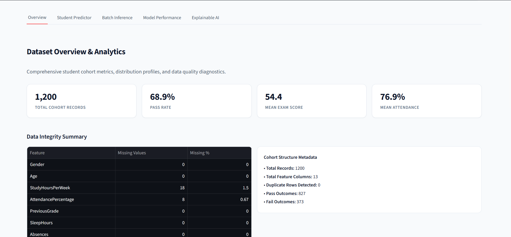
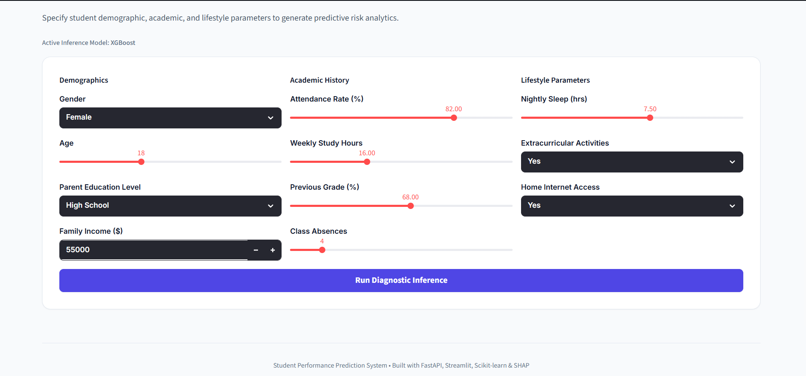
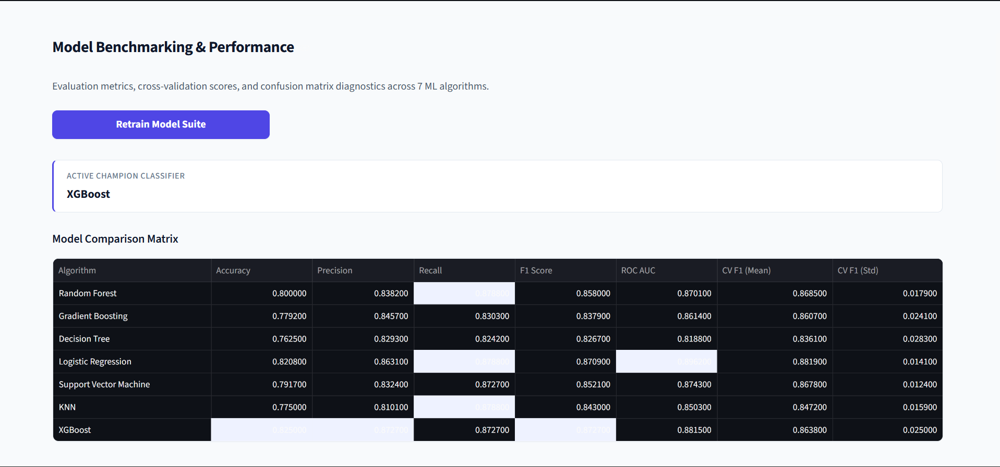

# Student Performance Prediction using Machine Learning

## Project Overview

During my Learning process, I wanted to build a project that followed the complete machine learning workflow instead of only training a model in a Jupyter Notebook.

The goal of this project is to predict a student's academic performance using historical academic and behavioural data. Besides predicting performance, I also wanted to understand **why** a prediction was made, so I incorporated explainability using SHAP and built an interactive dashboard using Streamlit.

Rather than focusing only on model accuracy, this project explores the complete lifecycle of an ML application—from preprocessing and feature engineering to deployment.

---

## Application Preview

### Dashboard



### Prediction Page



### SHAP Explainability




---

# Problem Statement

Educational institutions often identify academically at-risk students only after examination results are published.

If students who are likely to struggle can be identified earlier, teachers and mentors can intervene with additional support, helping improve overall academic performance.

This project investigates whether machine learning models can learn patterns from student data and estimate academic performance before the final outcome.

---

# Dataset

The project uses a Student Performance dataset obtained from Kaggle.

The dataset contains information such as:

- Gender
- Age
- Attendance Percentage
- Previous Grades
- Study Hours
- Sleep Hours
- Internet Access
- Parent Education
- Family Income
- Extracurricular Activities
- Absences

These features were used to train supervised machine learning models.

---

# Project Workflow

This project follows a standard Machine Learning pipeline.

### 1. Data Preprocessing

Before training, the dataset was cleaned by

- Handling missing values
- Removing duplicate records
- Encoding categorical variables
- Scaling numerical features
- Preparing training and testing datasets

---

### 2. Feature Engineering

To improve prediction quality, additional features were created from the original dataset, including

- Attendance Ratio
- Study Efficiency
- Academic Risk Score
- Lifestyle Score

These engineered features helped the models capture more meaningful relationships within the data.

---

### 3. Model Training

Instead of relying on a single algorithm, I compared multiple supervised learning models including

- Logistic Regression
- Decision Tree
- Random Forest
- Gradient Boosting
- Support Vector Machine
- K-Nearest Neighbors
- XGBoost

Each model was evaluated using the same preprocessing pipeline.

The best-performing model was selected based on evaluation metrics rather than personal preference.

---

### 4. Model Evaluation

Models were compared using

- Accuracy
- Precision
- Recall
- F1 Score
- ROC-AUC Score
- Cross Validation

This helped identify the model that generalized best on unseen data.

---

### 5. Explainable AI

One objective of this project was not only to generate predictions but also to understand them.

SHAP was used to visualize

- Feature importance
- Local explanations
- Global explanations

This makes the prediction process easier to interpret instead of treating the model as a black box.

---

### 6. Deployment

The trained model was integrated into a Streamlit application where users can

- Enter student information
- Predict performance
- View risk category
- Understand prediction explanations
- Generate reports

The project also includes FastAPI endpoints for serving predictions through REST APIs.

---

# Technologies Used

### Programming

- Python

### Machine Learning

- Scikit-learn
- XGBoost
- SHAP

### Data Processing

- Pandas
- NumPy

### Visualization

- Plotly
- Matplotlib

### Deployment

- Streamlit
- FastAPI

---

# Repository Structure

```
project/
│
├── api/
├── config/
├── dataset/
├── frontend/
├── models/
├── preprocessing/
├── training/
├── utils/
├── tests/
├── app.py
├── train.py
├── predict.py
└── requirements.txt
```

---

# Running the Project

Clone the repository

```bash
git clone https://github.com/aishanyatripathi/Ai_driven_stu_performance_prediction.git
```

Install dependencies

```bash
pip install -r requirements.txt
```

Train the models

```bash
python train.py
```

Run the Streamlit application

```bash
streamlit run app.py
```

---

# Challenges Faced

This project involved several practical challenges during development.

Some of the issues I encountered included

- Designing a preprocessing pipeline that worked consistently for both training and inference.
- Comparing multiple models while keeping preprocessing identical.
- Understanding SHAP explanations and integrating them into the application.
- Resolving dependency conflicts during deployment on Streamlit Community Cloud.
- Fixing version compatibility issues between locally trained models and deployed environments.
- Improving the dashboard layout to make it easier to use.

Working through these problems helped me better understand how machine learning projects behave outside of notebooks.

---

# What I Learned

This project helped me gain practical experience with

- Building complete machine learning pipelines
- Feature engineering
- Model comparison
- Hyperparameter tuning
- Explainable AI
- Model serialization using Joblib
- API development using FastAPI
- Building interactive dashboards with Streamlit
- Deploying ML applications

More importantly, I learned that building a working machine learning application involves much more than training a model.

---

# Future Improvements

Some improvements I would like to explore include

- Collecting larger real-world datasets
- Experimenting with deep learning models
- Continuous model retraining
- User authentication
- Database integration
- Docker deployment
- CI/CD pipeline
- Cloud deployment using AWS or Azure

---

# Author

**Aishanya Tripathi**

AI & Machine Learning Enthusiast

GitHub:
https://github.com/aishanyatripathi

---

# Acknowledgements

This project was developed as part of my AI & Machine Learning Internship.

The dataset used in this project is publicly available on Kaggle.

I also referred to the official documentation of Scikit-learn, Streamlit, FastAPI, and SHAP while implementing different parts of the project.
